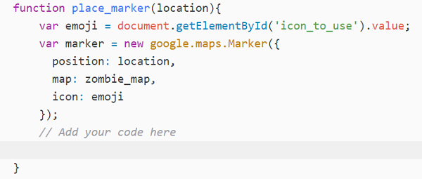
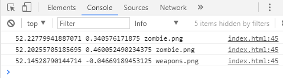

## Log your locations

Once you've created your map with the nifty map creator you just built, you want to be able to keep it and use it in the event of a zombie apocalypse. We need to be able to log the locations you chose and what was at each location, and for this we'll use the JavaScript console log.

+ Open the JavaScript console in your web browser.

[[[generic-javascript-opening-console]]]

The JavaScript console is helpful for debugging your programs. If they aren't working, you can check the console to see any error messages that might come up. You can also use the console if you want to see the value of a variable at a particular point in your program, or check whether it is running a particular piece of code.

We're going to cheat and use the console log to keep track of the latitude and longitude of each point, and what was at the point: zombie, hospital, or weapons.

+ We need to add some code so that when a marker is placed, its location and type are logged by the console. Add this code inside the `place_marker()` function.



+ Here is some code that will make the console log a message:

```JavaScript
console.log("You clicked the map");
```

Add this code, save the file, and then check that each time you click on the map, you the message `You clicked the map` appears in the console.

+ Finally, let's log the data we actually want. Remove the sentence `You clicked the map`, and replace it with code to log the latitude, longitude, and the type of emoji we used, so that it looks like this:



The variables `location.lat()`, `location.lng()`, and `emoji` contain strings. To log them, you will need to **concatenate** them, adding another string consisting of a single space between the variables.

[[[generic-javascript-concatenation]]]

--- hints ---

--- hint ---

To add a space between the values you will also need to concatenate in a string containing a space which looks like this: `" "`.

--- /hint ---

--- hint ---

Here is how your finished code should look:

```JavaScript
console.log(location.lat() + " " + location.lng() + " " + emoji);
```

--- /hint ---


--- /hints ---

+ Now that we have this data, we can save it and use it to recreate the map, a crucial element of our zombie survival plan.
